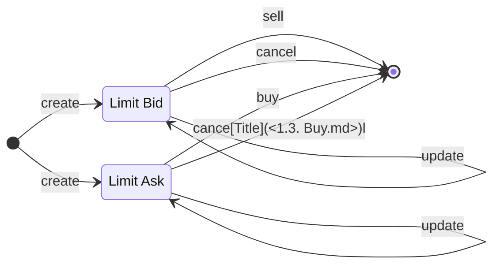
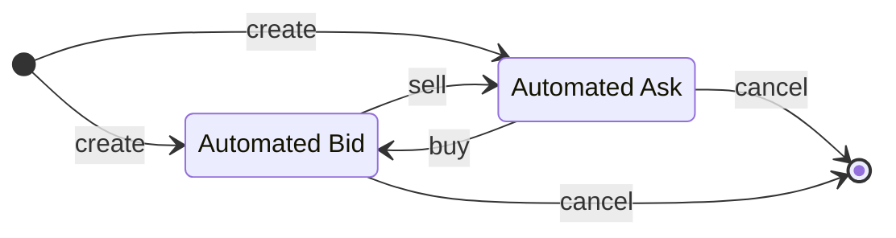

# Overview

This section introduces **Bond** **D**ecentralized **Ex**change (Bond Dex). Bond Dex help improve liquidity for bond holders by allowing trading bonds without having to wait until bond maturity. Moreover, users can create automated orders to automate their trading strategies.

## Bond

Danogo intends to support different bond types, the current whitelist is [Optim Bond](https://www.optim.finance/) and Danogo Bond (powered by Danogo) in the near future. So users can issue bond on these protocols and list the bonds on Bond Dex. Other users don't want to issue bond but still want to own bonds, they can browse bonds on Bond Dex and buying their desired bonds.

## Order

We classify orders into two groups: **Limit Order** and **Automated Order**. Each types serve different purposes

### Limit Order

Users can buy/sell bonds by creating limit orders:

- Limit Bid: Users deposit their ADA to buy a specified bond amount. Upon the order is matched, the bond tokens will be sent to the user address.
- Limit Ask: Users deposit their bond tokens to sell. Upon the order is matched, the exchange ADA will be sent to the user address.

Users can update/cancel their orders at anytime to adjust/withdraw their locked assets.

### Automated Order

Automated Orders are a powerful tool for liquidity providers and profit-seekers. Unlike limit orders, assets will be used to create a reverse order in the sale transaction instead of transferring to seller/buyer address. Users can also cancel automated orders anytime to withdraw their assets. Updating automated orders is disallowed.

