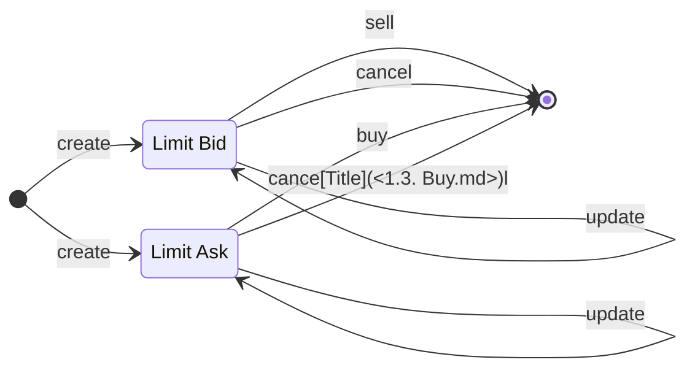
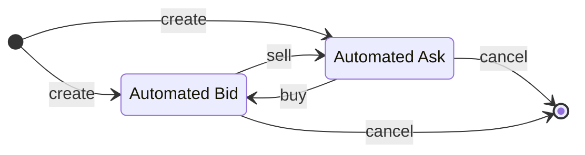

# Table of Contents

- [Table of Contents](#table-of-contents)
- [Overview](#overview)
  - [Smart Contract Interactions](#smart-contract-interactions)
  - [Bond](#bond)
  - [Order](#order)
  - [Limit Order](#limit-order)
  - [Automated Order](#automated-order)
- [Transactions](#transactions)
  - [Ask Limit::Create](#ask-limitcreate)
    - [UTxO Diagram](#utxo-diagram)
    - [Explanations](#explanations)
      - [Inputs](#inputs)
      - [Outputs](#outputs)
      - [Redeemers](#redeemers)
  - [Ask Limit::Update](#ask-limitupdate)
    - [UTxO Diagram](#utxo-diagram-1)
      - [Increase number of bond token](#increase-number-of-bond-token)
      - [Reduce partially number of bond token](#reduce-partially-number-of-bond-token)
      - [Reduce all number of bond token (cancel ask limit)](#reduce-all-number-of-bond-token-cancel-ask-limit)
    - [Explanations](#explanations-1)
      - [Inputs](#inputs-1)
      - [Outputs](#outputs-1)
      - [Redeemers](#redeemers-1)
  - [Ask Limit::Buy](#ask-limitbuy)
    - [UTxO Diagram](#utxo-diagram-2)
    - [Explanations](#explanations-2)
      - [Inputs](#inputs-2)
      - [Outputs](#outputs-2)
      - [Redeemers](#redeemers-2)
  - [Bid Limit::Create](#bid-limitcreate)
    - [UTxO Diagram](#utxo-diagram-3)
    - [Explanations](#explanations-3)
      - [Inputs](#inputs-3)
      - [Outputs](#outputs-3)

# Overview

This section introduces **Bond** **D**ecentralized **Ex**change (Bond Dex).

## Smart Contract Interactions

 Bond Dex help improve liquidity for bond holders by allowing trading bonds without having to wait until bond maturity. Moreover, users can create automated orders to automate their trading strategies.

## Bond

Danogo intends to support different bond types, the current whitelist is [Optim Bond](https://www.optim.finance/) and Danogo Bond (powered by Danogo) in the near future. So users can issue bond on these protocols and list the bonds on Bond Dex. Other users don't want to issue bond but still want to own bonds, they can browse bonds on Bond Dex and buying their desired bonds.

## Order

We classify orders into two groups: **Limit Order** and **Automated Order**. Each types serve different purposes

### Limit Order

Users can buy/sell bonds by creating limit orders:

- Limit Bid: Users deposit their ADA to buy a specified bond amount. Upon the order is matched, the bond tokens will be sent to the user address.
- Limit Ask: Users deposit their bond tokens to sell. Upon the order is matched, the exchange ADA will be sent to the user address.

Users can update/cancel their orders at anytime to adjust/withdraw their locked assets.

### Automated Order

Automated Orders are a powerful tool for liquidity providers and profit-seekers. Unlike limit orders, assets will be used to create a reverse order in the sale transaction instead of transferring to seller/buyer address. Users can also cancel automated orders anytime to withdraw their assets. Updating automated orders is disallowed.

# Transactions

## Ask Limit::Create

### UTxO Diagram

### Explanations
#### Signatories:

- User Wallet

#### Inputs

- User UTxO

#### Outputs

- Ask Limit UTxO: Hold info of ask limit and bond token

## Ask Limit::Update

### UTxO Diagram
#### Increase number of bond token

#### Reduce partially number of bond token

#### Reduce all number of bond token (cancel ask limit)

### Explanations
#### Signatories:

- User Wallet

#### Inputs

- User UTxO
- Ask Limit UTxO

#### Outputs

- Ask Limit UTxO: Hold info of ask limit and bond token after modification. This UTxO maybe not exist in output if user update quantity of bond token to 0
- User UTxO: If user reduces quantity of bond token. They will receive bond back.

#### Redeemers

- Update

## Ask Limit::Buy

### UTxO Diagram
#### Buy partially

#### Buy all

### Explanations
#### Signatories:

- User Wallet (Buyer)

#### Inputs

- User UTxO (Buyer)
- Ask Limit UTxO

#### Outputs

- Ask Limit UTxO: Hold info of ask limit and bond token after sale. This UTxO maybe not exist in output if buyer bought all bonds in ask limit order
- Buyer UTxO: Receive bond
- Seller UTxO: Receive ADA. The address's info of seller was stored in datum of Ask Limit UTxO 

#### Redeemers

- Buy

## Bid Limit::Create

### UTxO Diagram

### Explanations
#### Signatories:

- User Wallet

#### Inputs

- User UTxO

#### Outputs

- Bid Limit UTxO: Hold info of ask limit and ADA that user deposited to buy number of corresponding bonds.
